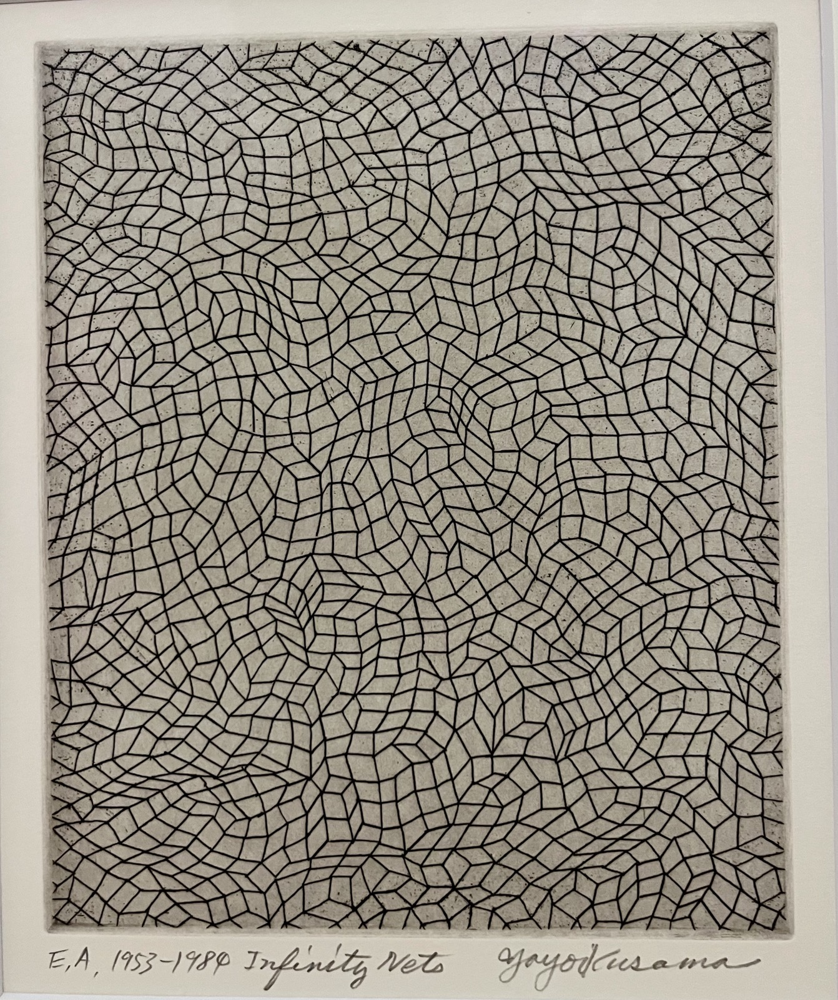

[about](about.md)  |  [publications](publications.md)  |  [lectures & talks](lectures_talks.md)  |  [teaching](teaching.md)  | [digital resources](dig_res.md) | [LiLi revisited colloquium](colloquium.md)

photo by berenike herrmann at [fondation beyeler](https://www.fondationbeyeler.ch/en/exhibitions/past-exhibitions/yayoi-kusama), basel, CC-BY-SA

### research colloquium "Linguistics and Literature revisited"

  
The Bielefeld research colloquium "Linguistics and Literature revisited" ("LiLi revisited: Digitale Schnittstellenforschung zwischen Literaturwissenschaft und Linguistik") fosters a vibrant interface between literary studies, (computer) linguistics, psychology and the social sciences. It is a forum for the discussion of current approaches and new findings in data-driven literary and cultural studies, addressing the forms and functions of textual phenomena in socio-historical contexts.  We thus complement philological and social-historical perspectives by methods and theories from Digital Humanities (DH), Computational Literary Studies (CLS), Natural Language Processing (NLP) and the Empirical Study of Literature.

In addition to joint readings and the discussion of individual guest lectures, participants present ongoing projects, conduct data sessions and test new ideas.
The colloquium is aimed at all interested participants. MA and BA students (including Literary Studies, Linguistics, Computational Linguistics, Media Studies) are very welcome.

Typically, one or two talks per semester are by invited external guests. We regularly co-invite guests together with the Computational/Digital Linguistics Work Group Meeting (chaired by [Prof. Dr. Hendrik Buschmeier](https://dililab.uni-bielefeld.de/) and [Prof. Dr. Sina Zarrieß](https://sinazarriess.github.io/) at Uni Bielefeld).

We are meeting weekly during the summer and winter terms, on Tuesdays 10:15–11:45. It's possible to join via Zoom. Please drop me a line at: berenike.herrmann@uni-bielefeld.de

Here's an overview of upcoming and past talks:

## upcoming

- May 26, 2026: [Dr. Svenja Guhr](https://svenjaguhr.github.io/) (UC Berkeley): __"Listening to Fiction: Tracing Sound and Loudness in Narrative"__

Abstract: This talk explores how sound shapes the structure of literary prose by tracing patterns of auditory cues and loudness across narrative texts. Combining computational scene segmentation with fine-grained sound annotation, it examines character sounds and their varying intensity: from whispers to bursts of heightened loudness. Mapping these acoustic patterns onto narrative structure reveals sound as a dynamic and measurable feature of storytelling. Rather than serving as mere background detail, sound emerges as a key mechanism through which literary fiction structures experience and brings its scenes to life.

- June 23, 2026: [Dr. Giulia Grisot](https://research.manchester.ac.uk/en/persons/giulia-grisot/) (Manchester): __"Beyond Keywords: Modelling Environmental Representation in Climate Fiction"__

Abstract: This talk introduces a computational method for analysing how environments are represented in climate fiction, moving beyond simple keyword-based approaches. Rather than treating the environment as a set of isolated nouns, the method models environmental meaning as emerging from relations between entities, processes, and descriptive conditions. Combining distributional semantics with curated lexicon construction and manual validation, the approach distinguishes between _trigger_ terms that signal environmental relevance and _descriptor_ terms that qualify and shape environmental experience. Applied to a corpus of climate fiction, this two-stage pipeline reveals recurring semantic and descriptive patterns linked to environmental degradation, climatic extremity, and spatial transformation. The talk argues for a shift from keyword detection to relational models that better capture the stylistic and semantic complexity of literary environmental representation.

## archive

### winter term 2025/26
- January 1, 2026: [Dr. Katrin Rohrbacher](https://www.dhss.phil.fau.de/person/dr-katrin-rohrbacher/) (Nürnberg/Erlangen) "Measuring Narrative Space: A Computational Study of German and English Prose Fiction"

### summer term 2025
- May 20, 2025: [Prof. Dr. Nils Reiter](https://nilsreiter.de/) (Köln) "More Open Science is not always the same as better science"
- June 10, 2025: [Prof. Dr. David Bamman](https://people.ischool.berkeley.edu/~dbamman/) (Berkeley) "Measuring Representation and Linguistic Variation in Hollywood"
  
### winter term 2024/25
- October 15, 2024: [Sophie Modert](https://www.grk-gegenwart.uni-bonn.de/de/personen/sophie-modert) (Bonn) "Natonaler Kanon? Schulische Lesebücher im Spannungsfeld von politscher und kultureller Identität in der Deutschschweiz des 19. Jahrhunderts"
- December 20, 2024: [Dr. Elias Kreyenbühl](https://libraries.dsi.uzh.ch/member/chris-p-bacon/) (Zürich) "Daten öffnen, Forschung fördern. Initiativen mit denen die Zentralbibliothek Zürich die Digital Humanities unterstützt"
- January 14, 2025: [Dr. Lore de Greve](https://research.flw.ugent.be/en/lore.degreve) (Gent) "Von der Jury zum Hashtag: Eine digitale Sentiment-Analyse von ‘small critics’ im Vergleich zur professionellen Literaturkritik"
  
### summer term 2024 (organized together with Daniel Kababgi)
- May 14, 2024: [Agnes Hilger](https://www.graduateschools.uni-wuerzburg.de/humanities/personen/promovierende/hilger-agnes/) (Würzburg) "Figurenbeschreibungen in deutschsprachigen Romanen (1790–1915)"
- May 21, 2024: [Dr. Alexa Lucke](https://sfb1472.uni-siegen.de/personen/dr-alexa-lucke) (Bielefeld) "Der heuristische Wert des Natural Language Processing für die computationelle Analyse literarischer Texte des 'Naturalismus' und der 'literarischen Moderne'"
- June 4, 2024: [Dr. Orel Sharp](https://orelsharp.academia.edu/) (Frankfurt) "Stylometric Analysis and Close Reading of Mapu's 'AYIT ẔAVUA': Tension and Completion"
- July 9, 2024: [Dr. Désirée Kleineberg](https://ekvv.uni-bielefeld.de/pers_publ/publ/PersonDetail.jsp?personId=308568215) (Bielefeld) "Diffusion und Rückzug der französischen Verbalperiphrase '_aller_ + Partizip Präsens' - Die Rolle von sozio-kulturellen Verflechtungen, Diskurstraditionen und literarischen Genres"
  
### winter term 2023/24 (organized together with Daniel Kababgi)
- October 17, 2023: [Prof. Dr. Álvaro Ceballos](https://www.uliege.be/cms/c_9054334/fr/repertoire?uid=u210165) (Lüttich)"Hermeneutische Tropologie und die Rezeption von _Pequeñeces_ (_Lappalien_)"
- January 9, 2024: [Dr. Jan-Niklas Meier](https://ekvv.uni-bielefeld.de/pers_publ/publ/PersonDetail.jsp?personId=58652897) (Bielefeld) "Semantische Ko-Okkurenz als Ausgangspunkt narrativer Modalitäten in Rollenspiel-Regelwerken"
- January 30, 2024: [Dr. Mark Finlayson](https://www.cis.fiu.edu/faculty-staff/mark-finlayson/) (Florida) "Computational Approaches to Understanding Narrative"

  
### summer term 2022
(guest lectures in my literary history lecture)
- June 21, 2022: [Prof. Dr. Moritz Baßler](https://cris.uni-muenster.de/portal/de/person/46853686) (Münster) "Zur Geschichte literarischer Verfahren"
- June 7, 2022: [Prof. Dr. Gerhard Lauer](https://gerhardlauer.de/) (Mainz) "Einfache Formen? Zur Methodologie der Kinderbuchforschung"
- May 3, 2022: [Prof. Dr. Evelyn Gius](https://evelyngius.de/de/) (Darmstadt) "Die Romantik computationell betrachten"
  
### summer term 2021
- June 30, 2021: [Dr. Maria Kraxenberger](https://www.phil.uni-mannheim.de/anglistik/abteilungen/anglistik-literatur/jun-prof-maria-kraxenberger/) (Stuttgart) "Wreading auf digitalen Literaturplattformen"

  
### winter term 2020/21 
[FU Berlin, "Trends in data-driven humanities"](https://userwikis.fu-berlin.de/spaces/dhtrends/pages/730988763/Trends+datengetriebene+Geisteswissenschaften)
- December 3, 2020: [Assoc. Prof. Dr. Matthew Wilkens](https://bowers.cornell.edu/people/matthew-wilkens) (Cornell) "Computational approaches to large-scale literary geography"
- December 17, 2020: [Dr. Anne-Sophie Bories](https://universe.unibas.ch/people/14042/47837/overview) (Basel) & [Dr. Petr Plecháč](https://ucl.cas.cz/pracovnik/plechac/) (Basel) "Exploring Verse and Jokes"
- January 14, 2020: [Dr. Emily Troscianko](https://troscianko.com/) (Oxford) and [Assoc. Prof. Dr. James Carney](https://texturejc.github.io/carney_profile/) (London): "'A picture held us captive': Imagery, perspective, and the text–mind connection in Kafka's Schloß"
- January 21, 2020: [Prof. Dr. Bettina Kümmerling-Meibauer](https://uni-tuebingen.de/fakultaeten/philosophische-fakultaet/fachbereiche/neuphilologie/deutsches-seminar/abteilungen/neuere-deutsche-literatur/mitarbeitende/apl-prof-dr-bettina-kuemmerling-meibauer/) (Tübingen) "Emotionale Netzwerke. Die Bedeutung von Empathie in der Kinderliteratur"
- January 27, 2020: [Dr. Peter Leinen](https://gepris.dfg.de/gepris/person/1580787) (Deutsche Nationalbibliothek) "Digitale Geisteswissenschaften, Bibliotheken und Archive - gesucht und gefunden? Möglichkeiten und Herausforderungen im digitalen Zeitalter"
- January 29, 2020: [Prof. Dr. Kath Bode](https://slll.cass.anu.edu.au/centres/calc/people/professor-katherine-bode) (Australian National University) "Data beyond representation: From computational modelling to performative materiality"
- February 12, 2020: [Prof. Dr. Matt Erlin](https://artsci.washu.edu/faculty-staff/matt-erlin) (St. Louis) and Prof. Dr. Andrew Piper (Montreal) "Cultural Capitals: Modeling ‘Minor’ European Literature"
