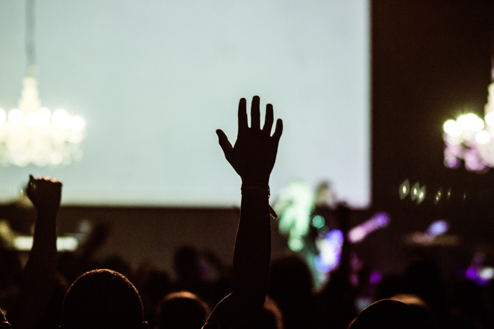

[about](about.html)  |  [publications](publications.html)  |  [lectures & talks](lectures_talks.html)  |  [teaching](teaching.html) | [digital resources](dig_res.html)

## lectures & talks

photo by carlos arthur m.r on unsplash

### conference talks (selection)

**keynote lectures**

05/2020 “Digital Literary Stylistics. How Corpora are Changing Literary Studies.” [41st International Conference ICAME 2020](https://icame41.as.uni-heidelberg.de/plenaries/) “Language and Linguistics in a Complex World: Data, Interdisciplinarity, Transfer, and the Next Generation”, Heidelberg, D. 

06/2019 “What is Your Style? On Linear and Non-linear Modes of Reading in Digital Literary Stylistics”. International Conference “Questioning the text in the era of “mechanical intelligence”: Digital stylistics between disciplinary and interdisciplinary studies”, Montpellier, F.

09/2017 "WYSIWYG? Getting Behind the Scenes of Digital Humanities Research". [#DHDS Symposium](http://www.ghentcdh.ugent.be/content/dhds-symposium-keynote-dr-berenike-herrmann-basel) "Loading: Methods and Approaches in Digital Humanities", Ghent Centre for Digital Humanities, Ghent University.

**invited talks**

11/2019 Invited talk “Computationally Revisiting World Literature in German – The Kafka Case”. Symposium “Literature in the world: Material networks of books to and from Goethe’s Weimar”, St John’s College, Oxford, UK.

10/2019 Invited talk “Lovely! Books. Mining Literary Valuation in Lay Readers’ Reviews” 4th Annual Conference SFB “Medien der Kooperation” on “Data Practices: Recorded, Provoked, Invented“, Siegen, D.

07/2019 Invited lecture “Qualitative and Quantitative Computational Metaphor Analysis”, 2nd Summer School of Computational Humanities, Universität Heidelberg, D.

05/2019 Invited lecture “Sentiment and Emotion in Digital Text Analysis” at “Doing Digital Projects”, GRACE Graduate Training Workshop. Basel University, CH.

02/2019 Invited talk “Mixed Methods Approaches to Metaphor Analysis: Manual and Algorithmic Methods for Metaphor Annotation”. CERES (Center for Religious Studies), Ruhr Universität Bochum, D. (with [Dr. Nils Reiter](https://nilsreiter.de/))

01/2019 Invited talk “How do Users Evaluate Literary Texts on the Web 2.0? A Textual Approach”. Research Colloquium "Didaktik der Deutschen Sprache und Literatur", Göttingen University, D.

12/2018 Invited talk “Digital Literary Stylistics. Concepts, Methods, Results“. Research Colloquium DH Lab Universität Basel. Basel, CH. (with [Wolfgang Meier](http://exist-db.org/exist/apps/homepage/index.html), eXist solutions)

10/2018 "Kafka’s Worlds as Data: Rediscovering the Skillful Un/making of Certainty Through Computational Analysis". “Novel Worlds. Theory and Computation”, Conference of [NovelTM. Text Mining the Novel](https://novel-tm.ca/?attachment_id=880#main). A Multi-University Digital Humanities Initiative. McGill University Montreal, CAN.

10/2018 Invited lecture "Capture, Preserve, Access – From Data to Knowledge at the DH Lab Basel". At conference “Des données aux savoirs. Les enjeux du numérique dans la recherche en Sciences Humaines et Sociales». [Colloque Maison Interuniversitaire des Sciences de L’Homme](https://www.uha.fr/2018/07/18/colloque-des-donnees-aux-savoirs-les-enjeux-du-numerique-dans-la-recherche-en-sciences-humaines-et-sociales/)  Strasbourg, F.

04/2018 Invited lecture "Text Mining for Cultural Heritage: A very Short Intro to Measures of Readability and Metaphor". [Atelier Numérique](http://www.msh.univ-nantes.fr/96280119/0/fiche___actualite/&RH=ACCUEIL) “Gérer et explorer les données textuelles”, Le Mans University, France. 

11/2017 Invited talk "Where's literariness? Assessing literary style in German 19th C and early 20th C texts". Doktoranden- und Postdoc-Kolloquium Herman-Paul-School of Linguistics, Universität Freiburg i. Br., D and Universität Basel, CH.

03/2017 Invited talk "Text Mining Literature: Corpus and Methodology." (via skype). [Centre for the Advancement of Faculty Excellence](http://www.macewan.ca/wcm/MacEwanEvents/SS_CAFE_TEXT_MINING_17), McEwan University, Edmonton, Canada.

02/2017 Invited talk"Mining Stylistic Vividness in Narrative Beginnings. A Scaled Analysis of German Modernism". At Digital Scholarship Conversations. [Institute for Advanced Studies (IAS)](https://www.ias.edu/sites/default/files/media-assets/2-27_Herrmann_DSConversations.pdf), Princeton, USA.

12/2016 Invited talk "Q-LIMO. Quantitative Analyse von Erzähltexten der Klassischen Moderne – und darüber hinaus". At [Potsdamer Arbeitstreffen zur digitalen Literaturwissenschaft](http://www.uni-potsdam.de/lit-19-jhd/digitale-literaturwissenschaft/potsdamer-arbeitstreffen.html), Potsdam, Germany. (with [Markus Paluch](https://www.researchgate.net/profile/Markus_Paluch))
 
 09/2016 Invited lecture "Basic experiment design and hypothesis testing". At [IGEL/E-READ Training School: Empirical Methods for Humanities scholars](http://ereadcost.eu/empirical-methods-humanities/). Max-Planck-Institute for Empirical Aesthetics, Frankfurt. [Watch video here](https://youtu.be/fU-M5poDik4).
 
10/2013 Invited talk "Kafka among the authors. Stylometric analyses". At Expert Workshop “Stylometry@Kraków”, Krakow, Poland. 

06/2013 Invited talk "Metaphor in academic texts". At Research Lecture Series of the English Linguistics Department, Göttingen University. 

02/2013 Invited lecture "Computergestützte Textanalyse. Formen, Muster und Vergleiche. At "Symposium Deutschdidaktik – Nachwuchsnetzwerk 'Schreiben - Erheben - Fördern'", Göttingen University.

12/2012 Invited lecture "Doing digital text analysis with “literary” students. Clash of cultures or new beginnings?" At Digital Text Analysis Working Group, Göttingen Centre for Digital Humanities (GCDH). 

06/2010 Invited lecture "Patterns and functions of metaphorical language in the academic genre: Combining quantitative and qualitative evidence from the British National Corpus". At Pragmatics and Stylistics Research Group (PaSTY), Department of Linguistics and English Language, Lancaster University, UK. 
 
 
**refereed contributions to conferences and workshops**

02/2020 Judge a book by its lover: Evaluation and sentiment in online lay book reviews (with Thomas Messerli), Tagung der [VALS-ASLA, Neuchâtel, CH](https://www.unine.ch/colloquevals-asla2020/).

07/2019 Where’s your attention? An empirical assessment of Web 2.0 users’ literary values (with Thomas Messerli), Panel “Digital Humanities for the Study of Social Reading”, International Conference DH2019 Utrecht, NL.

07/2019 Crossing the border between real world and story world: An empirical examination of interoceptive anchors in literature (with Moniek Kuijpers and Karin Kukkonen). International PALA Conference, Liverpool, UK.

07/2018 Assessing metaphor use in the opening sections of German narrative texts 1880-1930. International Conference of the Society for the Empirical Study of Literature and Media (IGEL), Stavanger, NO.

02/2017 Das "Was-bisher-geschah" von KOLIMO. Ein Update zum Korpus der literarischen Moderne. (with Gerhard Lauer). 4th International Conference "Digital Humanities im deutschsprachigen Raum" (DhD), Berne. 

10/2017 Operationalisierung der Metapher zur quantifizierenden Untersuchung deutschsprachiger literarischer Texte im Übergang von Realismus zur Moderne. DFG-Symposium "Digitale Literaturwissenschaft”, Villa Vigoni, I.

09/2017 Cognitive and emotional aspects of literary prose reading: An eye tracking study (with Anne Mangen, Massimo Salgaro, Pasqualina Sorrentino, Gitte Balling, Michael Burke, Jana Lüdtke, and Art Jacobs). COST-Action eRead International Scientific Conference “Books and Screens and the Reading Brain”. Vilnius, Lithuania.

02/2017 Short Texts in Authorship Attribution. The Case of Robert Musil’s War Articles. (with Gerhard Lauer, Simone Rebora, Massimo Salgaro). 6th AIUCD Conference, Rome, Italy. 

07/2016 KAREK: Building and Annotating a Kafka/Reference Corpus. (with Gerhard Lauer). International Conference Digital Humanities 2016, Krakow, Poland.

07/2016 Measuring Kafka's Diaries. A Psychostylistic Approach (with Gerhard Lauer and Cosima Mattner). International Society for the Empirical Study of Literature and Media (IGEL), Chicago, USA.
 
03/2016 Aufbau und Annotation des Kafka/Referenzkorpus. (with Gerhard Lauer). 3rd International Conference "Digital Humanities im deutschsprachigen Raum" (DhD) Leipzig, Germany.

03/2016 Kafkas Stil. Zur Psychostilistik der Tagebücher Kafkas. (with Gerhard Lauer and Cosima Mattner). DhD Leipzig, Germany.  

11/2015 Präzise! Probleme naturwissenschaftlich-empirisch orientierter Forschung in der Literaturwissenschaft. Conference "Im Laboratorium – Entwurf & Experiment als ästhetische Zugriffsweisen auf 'Welt'", Bayreuth, Germany. 

06/2015	Combining quantitative and qualitative methods in digital analyses of literary style. Digital Humanities Benelux Conference 2015, Antwerp, Belgium.
 
09/2014	On the functions of modal particles in Franz Kafka’s narrative strategies. Interdisciplinary Conference “The biological-cognitive bases of narrative motivation“, Göttingen, Germany. 

07/2014	Does reading canonical literary fiction improve Theory of Mind in adolescents? International Society for the Empirical Study of Literature and Media (IGEL), Turin, Italy.  

12/2013	Computing Kafka - How keyness and collocation analysis help explain paradoxical style. International Herrenhausen Conference “(Digital) Humanities Revisited – Challenges and Opportunities in the Digital Age”, Hanover, Germany. 

11/2013 Breaking the wall of Franz Kafka’s paradox. Falling Walls Lab, Berlin, D. (Finalist)  

07/2012 Fiction vs. academic prose. Comparing the distribution of metaphor types in two registers of English. International Society for the Empirical Study of Literature and Media (IGEL), Montreal, CDN. 

06/2011 Exploring metaphorical language use in academic prose. A cross-register corpus-analysis. International Stylistics Across Disciplines (SAD) Conference, Leiden University, NL. 

 
**refereed poster contributions to international conferences**  

11/2019 "Digital Practices. Reading, Writing and Evaluation on the Web". At International conference "Reading in a Digital Environment: Media Use, Functional Literacies and Future Challenges for Universities", Universität Regensburg, D (with Gerhard Lauer, Piroska Lendvai, Simone Rebora, Moniek Kuijpers, Noah Bubenhofer, Thomas C. Messerli, Maria Kraxenberger, Brigitte Gasser).

12/2018 "Is it all Like!? Studying Research Epistemologies in the Textual Humanities in Case Studies of Sentiment Analysis". (with Daniel Knuchel, Noah Bubenhofer, Thomas Messerli). Digital Futures Network Day. Connecting Research Projects on Digital Traces and Society. EPFL Habitat Research Center, Lausanne, CH.

11/2018 "Towards Textual Studies’ High Tide? Studying Research Epistemologies in Digital Humanities after the Machine Learning Turn". (with Thomas Messerli, Daniel Knuchel, Noah Bubenhofer). Workshop DARIAH-CH, University of Neuchâtel, 29-30th November 2018.

02/2016 "KOLIMO: Aufbau und Annotation eines Korpus der literarischen Moderne. (with M. Paluch, C. Schmidt, B. Spermoser). Poster-Session der Sektion Computerlinguistik, 38. Jahrestagung der Deutschen Gesellschaft für Sprachwissenschaft (DGfS 2016), Konstanz, Germany. 

12/2013 "Computing Kafka - How Keyness and Collocation Analysis help Explain Paradoxical Style". International Herrenhausen Conference “(Digital) Humanities Revisited – Challenges and Opportunities in the Digital Age”, Hanover, Germany. 

07/2007 "Emancipating Metaphor from Thought. MIP Applied to Lakoff and Johnson" (1980). International Cognitive Linguistics Conference (ICLC10), Krakow, Poland. 
 
 
**outreach activities**

12/2016 Video interview on scientific identity and perspective within the audio-visual exhibition "on/off. Vom Nobelpreis und den Grenzen der Wissenschaft", Georg-August-Universität Göttingen, D.

07/2015 Statement "Incorporate academic freedom in future visions of science and scholarship!"  Internal Volkswagen Foundation Opportunities Meeting: The Future of Funding Agencies. BBAW, Berlin, D.

04/2015 Introduction "Zu Herausforderungen der literaturwissenschaftlichen Korpusbildung und Annotation. DigLiGö –Digitale Literaturwissenschaft Göttingen. A grassroots dialog on functions and procedures of digital methods in the philologies“. Seminar für Deutsche Philologie, Georg-August-Universität Göttingen, D.

11/2014 Talk "A Place of One’s Own – Literal and Metaphorical". Retrospect of a Postdoc Mentee of the Dorothea Schlözer Postdoc Mentoring Program. Feierliche Abschlussveranstaltung des Postdoc-Mentoringprogramms, Georg-August-Universität Göttingen, D.

11/2013 Finalist Lighting Talk "Breaking the wall of Franz Kafka’s paradox". 2013 Falling Walls Lab Finale, Berlin, D.
