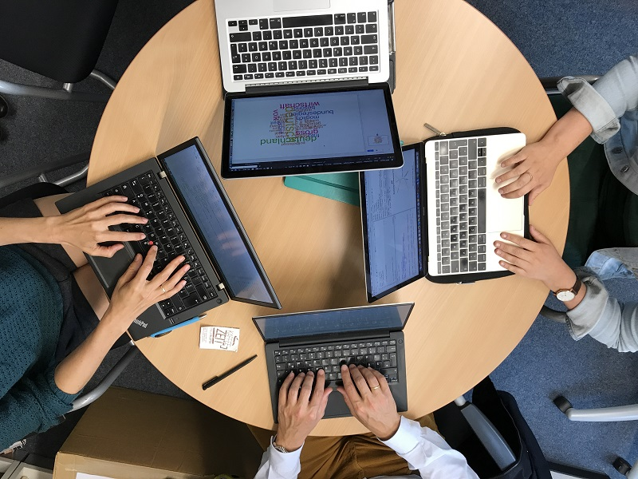

[about](about.md)  |  [publications](publications.md)  |  [lectures & talks](lectures_talks.md)  |  [teaching](teaching.md)

## university teaching

photo by andreas busch, CC-BY-SA

### Digital Humanities Lab, Universität Basel

_Spring Term 2020_

Seminar – «Kafkas Erzählungen lesen. Neue Perspektiven zwischen Hermeneutik und Algorithmik»

Seminar 55240-01 – «Trends in den computergestützten und experimentellen Geisteswissenschaften» (with Gerhard Lauer)

_Autumn Term 2019_

Seminar 55668-01 – «Korpusanalyse von Sprache und Kontext. Eine Einführung in Grundlagen und digitale Werkzeuge»

Training school – «Distant Reading. Tools and Methods», Programme doctoral en études numériques der Universitäten Lausanne, Neuchâtel, Basel [homepage](https://www.unil.ch/doc-digitalstudies/home/menuinst/activites-du-programme/distant-reading-tools-and-methods.html) (with Simon Gabay, Simone Rebora and Elias Kreyenbühl)

Seminar 55240-01 – «Trends in den computergestützten und experimentellen Geisteswissenschaften» (with Gerhard Lauer)

_Spring Term 2019_

Seminar 53942-01 – «Analyse sprachlicher Subjektivität nach dem Machine Learning Turn». See students'  [blog](https://digsub.hypotheses.org/)

Advanced Studies Graduate Program University Basel (GRACE) – «Doing Digital Projects» (with Silke Bellanger, Elias Kreyenbühl, Gerhard Lauer u.a.)

Seminar 53993 – «Text- und Kulturanalysen mit R» (with Gerhard Lauer, Markus Paluch, Sascha Wolfer)

_Spring Term 2018_

Seminar 50832-01 – «Konzeption und Analyse eines Korpus zur Klassischen Moderne. Eine Einführung» (with Gerhard Lauer)

Seminar 50833-01 – «Trends in den computergestützten und experimentellen Geisteswissenschaften» (with  Gerhard Lauer)

_Autumn Term 2017_

Seminar 50126-01 – «Textanalyse mit R» (with Gerhard Lauer)

### 2011-2017 Department German Philology, Georg-August-Universität Göttingen

BA Basisseminar 1.2 (Theorien und Methoden der Literaturwissenschaft), summer terms, 2011-2017

BA Basisseminar 1.1 (Einführung in den wissenschaftlichen Umgang mit literarischen Texten), winter terms 2011-2017

Interdisciplinary MA-Teaching/Research Course «Wahl der Sprache und Sprache der Wahl« (with Andreas Busch, Gerhard Lauer, & Madeleine Kaupert), Seminar für Deutsche Philologie Institut für Politikwissenschaft. See students'  [blogs](https://sprachederwahl.wordpress.com/), summer term 2017

BA Vertiefungsseminar «TextLab. Eine angewandte Einführung in die digitale Literaturwissenschaft» (with Dr. Annelen Brunner, Mathias Göbel). See students' [blogs](http://litlog.uni-goettingen.de/eine-app-auf-dem-vormarsch/). Koordiniert mit der mediävistischen Veranstaltung von Prof. Dr. Heike Sahm: «Dracula und Brandan im Norden» zur Edition niederdeutscher Texte. Winter term 2016/17

Integrated BA/MA-Course «CAPS: Computer-based Analysis of Personal Style», Research-oriented teaching and learning (FoLL) 03/2016-10/2016 (in English)

BA Vertiefungsseminar «Stilistik. Einführung und Theorie und (digitale) Praxis», summer term 2015 and winter term 2015/16

BA Vertiefungsseminar «Schöne Neue Literaturwissenschaft? Einführung in die digitale Textanalyse» (with Dr. Peer Trilcke), winter term 2012/13

BA Vertiefungsseminar «Literatur rechnen. Einführung in die digitale Textanalyse“ (with Prof. Dr. Gerhard Lauer), summer term 2013

BA Vertiefungsseminar «Metaphernanalyse», summer term 2011 and summer term 2012

MA Seminar «Literatur rechnen. Einführung in die digitale Textanalyse», winter term 2011/12

Interfacultary Course «Quantitative Text Analysis with R and Python» (with Juan Garces, Gerhard Lauer, Matt Munson, Arash Samadi, Sree Ganesh Thotempudi), Wintersemester 2012/13 und Sommersemester 2013

Interfacultary Course «Lesezirkel linguistische Diskursanalyse» (with JProf. Camilla Di Biase-Dyson), summer term 2014 (MA-Studierende Doktoranden und Lehrende)

BA Vertiefungsseminar «Kinder- und Jugendliteratur aus empirischer Perspektive», winter term 2013/14

BA Vertiefungsseminar «Einführung in die empirische Literaturwissenschaft», summer term 2014

MA Integratives Seminar «Emotion, Kognition und Literatur» (with Dr. Silke Kubik), winter term 2014/15

### 2007- 2011 Department of Language and Communication, VU University Amsterdam, NL

BA Specialisatiethema Duitse taalkunde, 3 – «Variatie: Jugendsprache» (with Dr. Maurice Vliegen) (auf Deutsch), 2009

BA «Duits Taalvaardigheid» (auf Deutsch), 2008/2009

BA «Semantiek van het Duits» (auf Deutsch), 2008/2009

MA «Metaphor, Theory and Application» (with Prof. G.J. Steen, Prof. A. Cienki, A.A. Kaal, A.G. Dorst, T. Krennmayr, and T. Pasma) (auf Englisch), 2008

BA «Semantiek van het Duits» (auf Deutsch), 2007/2008

Guest Lecture: Metaphorical language and Genre: Discussing empirical evidence from academic discourse, Leiden Institute of Advanced Computer Sciences, Leiden University, ‘Natuurwetenschappen voor niet-bètastudenten’, 05/2010

### Supervision of (Graduate) Students

Since 11/2018: Associate postdoc member of the Herman-Paul-School Graduate of Linguistics (Freiburg i. Br, D/Basel, CH). Supervision of PhD candidates 

_PhD Theses_

- Chr. Schmidt: working title: «What is literary literacy? Assessing concepts of literary education in Master students of German Language and Literature for Secondary Education by means of corpus-based methods» (Department German Philology, Georg-August-Universität Göttingen)

- G. Rotari: working title: «Empathy in/from Fairy tales? Examining narrative structures and their social-cognitive effects» (Department German Philology, Georg-August-Universität Göttingen)

- Mentor to Chr. Vögelin, working title: «The influence of linguistic features of ESL argumentative essays on teacher judgements» (Betreuende: Prof. Dr. Stefan D. Keller, Prof. Dr. Heike Behrens, Prof. Dr. Albert Düggeli; SNF-DFG Forschungsprojekt «ASSET – Assessing Students’ English Texts» Pädagogische Hochschule FHNW, Institut für Bildungswissenschaften Universität Basel, Christian-Albrechts-Universität zu Kiel)

_MA Theses_

A. Kasper (Department Linguistics and Literary Studies, University of Basel)

J. Engeler (Department Linguistics and Literary Studies, University of Basel)

S. Reith: Creative Writing by ‘Écriture Automatique‘: A viable resource for supporting highly gifted pupils in regular language education? Zweitbetreuerin (Department German Philology, Georg-August-Universität Göttingen)

C. Engfer: Die Funktion der Farben in Canettis Roman Die Blendung. Zweitbetreuerin (Department German Philology, Georg-August-Universität Göttingen)

A. Tietje: More than literary convention. A quantitative drama analysis assessing measurability of epoch features. Zweitbetreuerin (Department German Philology, Georg-August-Universität Göttingen)

L. Stöckicht: Sentiment Analysis as a quantitative digital method in literature and film studies. Zweitbetreuerin (Department German Philology, Georg-August-Universität Göttingen)

G. Rotari: Kafka’s style. A Quantitative Analysis. Zweitbetreuerin (Department German Philology, Georg-August-Universität Göttingen)

_BA Theses_

_Department German Philology, Georg-August-Universität Göttingen_

R. Weller: Using NLP word2vec analyses to detect implicit content in right-wing blogs. Erstbetreuerin

N. Foitzik: Digitale Erschließung und Analyse mittelniederdeutscher Texte. Zweitbetreuerin

L. Hannemann: "I was an ant, keeping a diary". A comparative metaphor analysis of Kästner's diaries. Erstbetreuerin

C. Mattner: The secret of Kafka‘s words. A dictionary-based diary analysis using the content analysis software LIWC. Zweitbetreuerin

N. Bölling: Wolfgang Herrndorf‘s Tschick– The German Catcher in the Rye? A comparative style analysis. Erstbetreuerin

C. Schmidt: Examining the theme of ‘bureaucracy’ as an impediment for Lotman’s transgression? A semiotic analysis of Kafka's novel The Castle. Erstbetreuerin

Y. Grube: Applying emotion-analytical methods to characterization analysis. On female protagonists in the dramatic genre bürgerliches Trauerspiel. Erstbetreuerin

L. Hantelmann: Round or Flat Character? Tracing the development of Simon Brenner in Wolf Haas’s detective novels. Zweitbetreuerin

B.-J. Kayser: Functional illiteracy. Zweitbetreuerin

Chr. Schmidt: Spotlight on the reader. Examining the relationship between attention and empathy in fiction reading, Erstbetreuerin.

J. Hinrichs: An empirical examination of (literary) reading socialization and its influence on reading behaviour, Erstbetreuerin

K. Engfer: Narrative voice and focalisation in Rilke's Poems on David and Soul, Zweitbetreuerin.

E. Schiffmann: The sensitive protagonist in Chr. F. Gellert's comedy. An analysis of character constellation, Zweitbetreuerin.

_Department of Language and Communication, VU University Amsterdam, NL_

2009 BA-Thesis I. Kremer: Metaphorical compounds in Youth Language, Erstbetreuerin

2009 MA-Thesis V. Vasilasky: American versus British English hedging in popular scientific magazines: An empirical study, Zweitbetreuerin.

### Publications with direct reference to higher education teaching

2013 	Herrmann, J. B. (2013). Computergestützte Textanalyse. Formen, Muster und Vergleiche. Workshop im Symposium Deutschdidaktik – Nachwuchsnetzwerk "Schreiben - Erheben - Fördern", Göttingen University

2012	Herrmann, J. B. (Ed.) (2012). Measuring literature. A wiki on digital text analysis. (in German)

2012	Herrmann, J. B. (2012). Doing Digital Text Analysis with “literary” students. A clash of cultures or new beginnings? Digital Text Analysis Working Group, Göttingen Centre for Digital Humanities (GCDH)

2012 	Was ist eigentlich Literatur? Und wie kann man sie wissenschaftlich erforschen? Eine Einführung in die Neuere Deutsche Literaturwissenschaft. Schülerinformationstage Universität Göttingen
